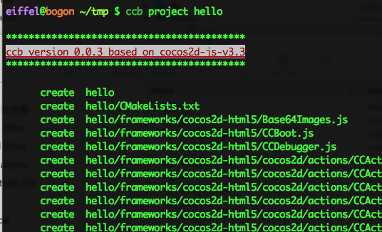
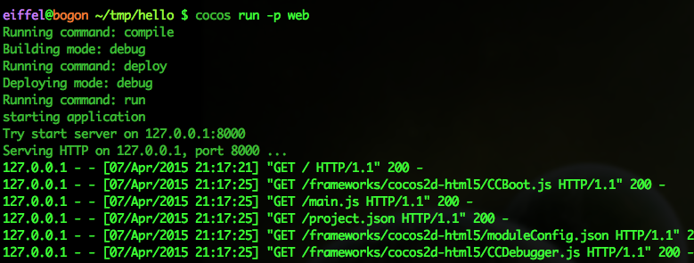
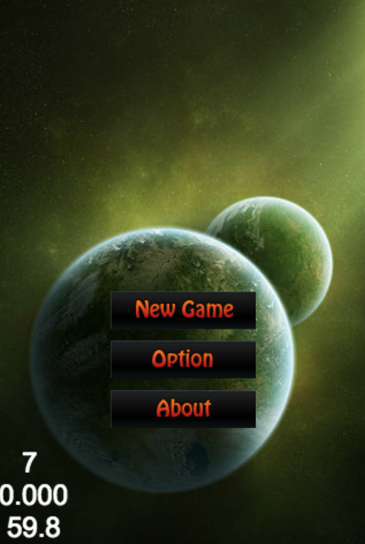
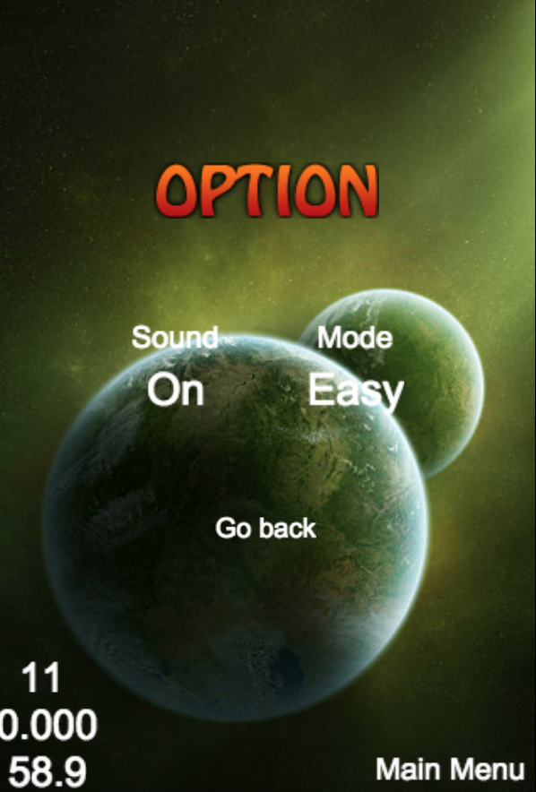
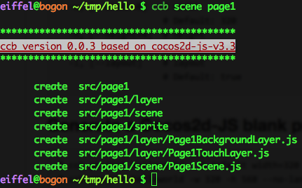

## Cocos2d-JS project builder tools.

### Installation

    $ gem install ccb 

### Help

    $ ccb 
    Commands:
      cbb project [NAME]  # generate a Cocos2d-JS app project
      cbb help [COMMAND]  # Describe available commands or one specific command
      cbb scene [NAME]    # generate an scene

    Options:
      -w, [--width=N]   # width
                        # Default: 320
      -h, [--height=N]  # height
                        # Default: 480
      -l, [--layout]    # layout
                        # Default: true

### Generate a Cocos2d-JS blank project

    $ ccb project hello   # default width=320 height=480 orientation=landscape
    $ ccb project hello -w 320 -h 568 --no-landscape # width=320 height=568 orientation=portrait  

    

### Run Default generated Cocos2d-JS project    

    $ cocos run -p web 

 
 
     	  

### Generate a scene file

    $ ccb scene page1

    
